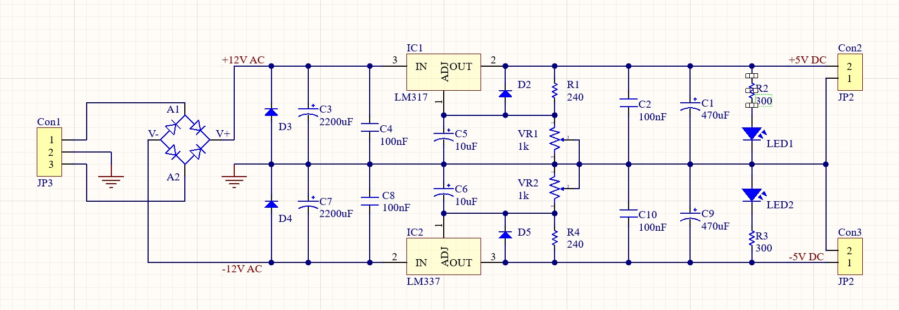
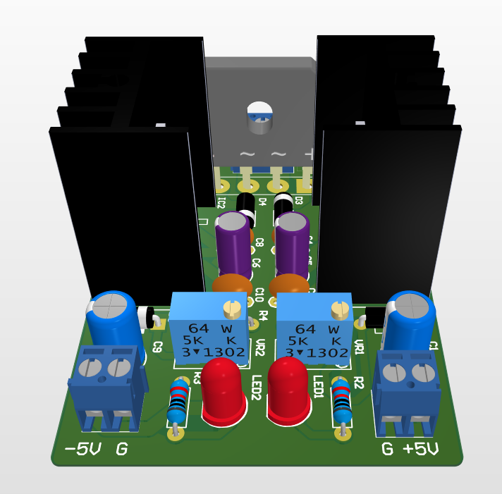
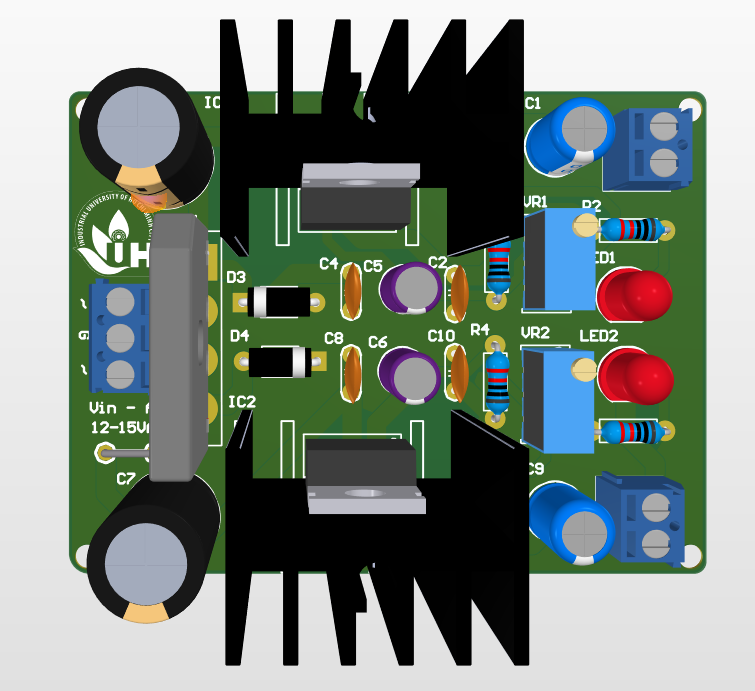
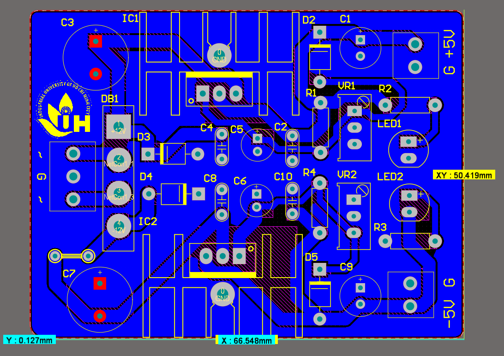
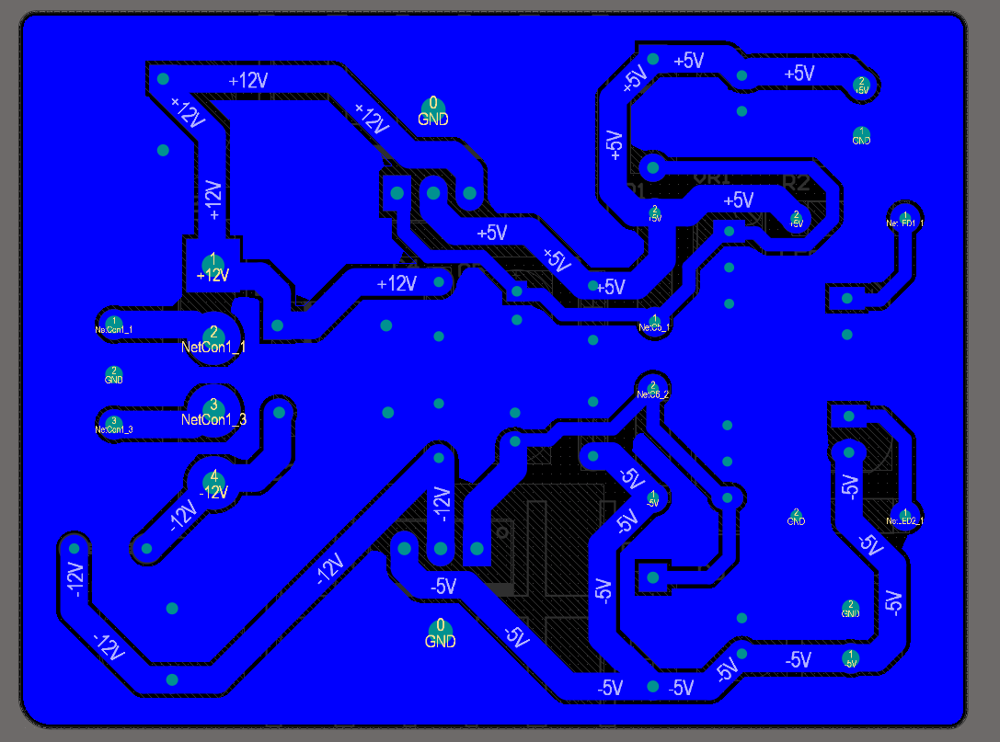

# Desription
This project was developed as the final assignment for the PCB Design course at Industrial University of Ho Chi Minh City (IUH). It also represents my first complete PCB project.

## 📌 Project Requirements
Design of a dual-polarity rectifier and linear voltage regulator circuit that generates adjustable positive and negative DC output voltages.

| Parameter | Requirement |
|-----------|-------------|
| PCB Design Software | Altium Designer 26 |
| PCB Layers | 1 Layers |
| Trace width | Use IPC2221 to calculate | 
| Size | 70 x 70 mm |
| Input Voltage | 12V AC |
| Output Voltage | Adjustable positive and negative 5V DC |
| Maximum Output Current | Up to 1.5 A (with big heatsink) |
| IC Regulators | LM317 and LM337 |

## 📌 Schematic


## 📌 3D view



## 📌 Calculations

### 1. Output voltage 📊📊📊

```text
VOUT = VREF × (1 + R2/R1)
```

According to datasheet:

- **VREF** = 1.25 V
- **R1** = 240 Ω

To obtain an output voltage of **5 V**:

```text
R2 = R1 × (VOUT / VREF − 1)

R2 = 240 × (5 / 1.25 − 1)

R2 = 240 × (4 − 1)

R2 = 720 Ω
```

==> Selected Resistor Values:R1 = 240 Ω and R2 = 720 v.
==> choose Variable Resistor = 1k Ω

The same resistor values are used for both the **LM317** and **LM337** to obtain regulated **+5 V** and **−5 V** outputs.

### 2. LED Current Limiting Resistor 📊📊📊

The LED current limiting resistor is calculated using Ohm's law:

```text
R = (VS - VF) / IF
```

Where:

- Supply Voltage (VS) = 5 V
- LED Forward Voltage (VF) ≈ 2.0 V
- LED Forward Current (IF) = 10 mA

Calculation:

```text
R = (5 - 2) / 0.01

R = 300 Ω
```
 ### 3. PCB Trace Width Calculation (IPC-2221) 📊📊📊

The PCB trace width is determined based on the maximum output current and the IPC-2152 design guideline.

The minimum PCB trace width is calculated according to the IPC-2221 standard.

#### Formula

```text
I = k × (ΔT)^0.44 × (A)^0.725
```

Where:

| Symbol | Description |
|--------|-------------|
| I | Current (A) |
| ΔT | Allowable temperature rise (°C) |
| A | Cross-sectional area of the trace (mil²) |
| k | 0.048 (External layer), 0.024 (Internal layer) |

The cross-sectional area is calculated by:

```text
A = W × T
```

Where:

| Symbol | Description |
|--------|-------------|
| W | Trace width (mil) |
| T | Copper thickness (mil) |

Rearranging the IPC-2221 equation:

```text
W = (I / (k × ΔT^0.44))^(1 / 0.725) / T
```

#### Design Parameters

| Parameter | Value |
|-----------|-------|
| Maximum Current | 1.5 A |
| Copper Thickness | 1 oz (1.378 mil / 35 µm) |
| External Layer | Yes |
| Allowable Temperature Rise | 10 °C |

#### Calculation

```text
I = 1.5 A
k = 0.048
ΔT = 10 °C
T = 1.378 mil
```

```text
A = (1.5 / (0.048 × 10^0.44))^(1 / 0.725)

A ≈ 33.4 mil²
```

```text
W = 33.4 / 1.378

W ≈ 24.2 mil
```

```text
24.2 mil × 0.0254

≈ 0.61 mm
```

#### Selected Design Value

Although the IPC-2221 calculation gives a minimum trace width of approximately **0.61 mm**, this project uses a **1.5 mm** trace width for all power traces to reduce voltage drop, improve heat dissipation, and provide additional design margin.

## PCB layout


Bottom layout:




